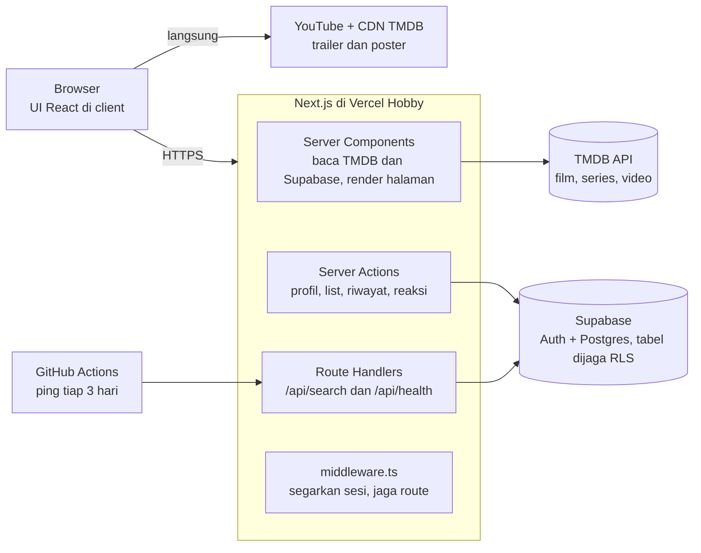
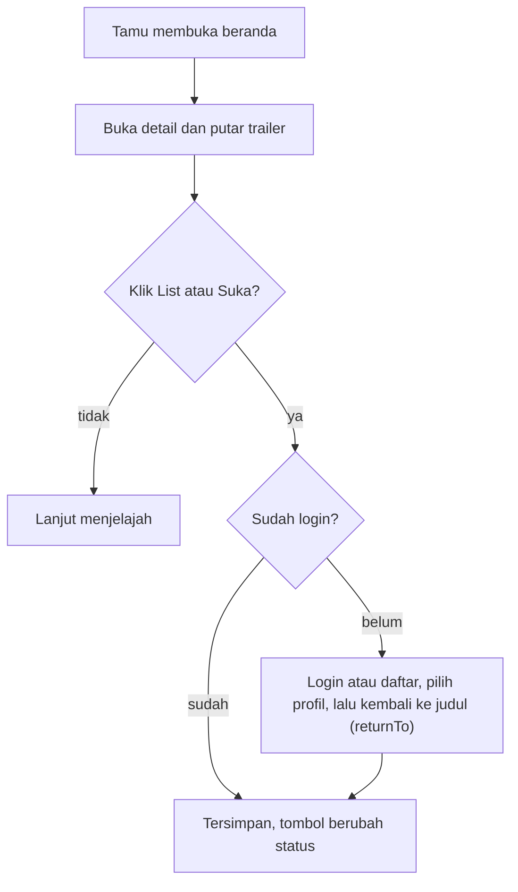

# Nontonin: Project Plan

Dokumen perencanaan lengkap untuk Nontonin, web streaming bergaya Netflix untuk portofolio: dibangun dengan Next.js, di-deploy gratis, dan memakai trailer dari TMDB sebagai konten.

**Isi dokumen:** [1. PRD](#1-prd) · [2. SRS](#2-srs) · [3. SDD](#3-sdd) · [4. UI/UX Flow](#4-uiux-flow) · [5. Task Breakdown](#5-task-breakdown)

---

# 1. PRD

## 1.1 Tujuan dan ringkasan

**Masalah:** portofolio yang cuma berisi tugas kuliah kurang meyakinkan; recruiter ingin melihat aplikasi full-stack yang hidup dan bisa dicoba langsung.

**Tujuan:** membangun web streaming bergaya Netflix (nama kerja: **Nontonin**, bebas diganti) yang membuktikan kemampuan Next.js, TypeScript, auth, database dengan RLS, integrasi API pihak ketiga, dan deployment, tanpa biaya sama sekali.

**Konten:** data film/series dan trailer dari TMDB. Tidak ada film berhak cipta yang di-host sendiri.

**Cakupan MVP:** browse, detail + trailer, pencarian, akun, multi-profil, My List, riwayat dilihat, reaksi suka/tidak suka. **Di luar cakupan:** pembayaran/langganan, upload film penuh, iklan (alasannya di bagian Risiko).

## 1.2 Stack gratis dan batasnya

Semua layanan di bawah punya tier gratis yang cukup untuk portofolio, selama project tetap **non-komersial** (tanpa iklan, tanpa pembayaran, tanpa affiliate).

| Kebutuhan | Layanan | Batas gratis | Catatan penting |
| --- | --- | --- | --- |
| Framework | Next.js (App Router) + TypeScript + Tailwind CSS + shadcn/ui | Open source | Tidak ada biaya lisensi |
| Hosting | [Vercel Hobby](https://vercel.com/pricing) | ~100 GB transfer, ~1 jt function call, ~1 jt edge request, ~4 jam active CPU per bulan | Hanya untuk penggunaan non-komersial; domain `*.vercel.app` gratis |
| Auth + database | [Supabase Free](https://supabase.com/pricing) | 500 MB database, 1 GB storage, 5 GB egress, 50 ribu MAU, 2 project aktif | **Project di-pause setelah 7 hari tanpa aktivitas**, solusinya ada di SDD bagian keep-alive |
| Data film dan gambar | [TMDB API](https://developer.themoviedb.org/docs/faq) | Gratis untuk non-komersial, batas atas sekitar 40 request/detik | Wajib menampilkan logo TMDB + teks atribusi |
| Trailer | YouTube embed (URL dari TMDB `/videos`) | Gratis | Hanya trailer, bukan film penuh |
| Repo + CI | GitHub + GitHub Actions | Gratis untuk repo publik | Repo publik sekaligus jadi bukti kode di portofolio |

Angka kuota berasal dari ringkasan pihak ketiga per September 2026 dan bisa berubah; cek ulang di halaman resmi (tautan di tabel) sebelum deploy.

## 1.3 User

| Persona | Siapa | Kebutuhan utama |
| --- | --- | --- |
| Recruiter / reviewer (utama) | Menilai portofolio dalam 2 sampai 5 menit | Bisa langsung menjelajah tanpa daftar, tampilan meyakinkan, ada repo + README yang jelas |
| Penonton (user akhir) | Orang yang mau mencari tontonan | Menemukan film cepat, lihat trailer, simpan ke daftar, punya profil sendiri |
| Anggota keluarga (profil) | Beberapa orang berbagi satu akun | Profil terpisah dengan My List dan riwayat masing-masing; profil anak dengan konten terbatas |

Persona **recruiter** menentukan keputusan desain: semua halaman penjelajahan terbuka untuk tamu, dan fitur yang butuh akun meminta login tepat saat dibutuhkan.

## 1.4 Fitur

Fitur dikelompokkan per prioritas; **Must** wajib selesai sebelum dibagikan ke recruiter. F09, F10, dan F12 ikut dikerjakan di sprint inti karena murah; sisanya masuk Sprint 6.

### Must have (MVP)

| ID | Fitur | Isi singkat |
| --- | --- | --- |
| F01 | Halaman utama | Hero billboard + baris film per kategori (Trending, Populer, Top Rated, per genre) |
| F02 | Detail judul | Poster, sinopsis, genre, durasi, rating, cast, judul serupa, tombol trailer |
| F03 | Pemutar trailer | Modal dengan YouTube embed; pesan jelas jika trailer tidak ada |
| F04 | Pencarian | Cari film dan series dengan debounce, hasil berupa grid |
| F05 | Auth | Daftar, masuk, keluar dengan email + password |
| F06 | Multi-profil | Layar "Siapa yang menonton?", maksimal 5 profil per akun |
| F07 | My List | Simpan dan hapus judul per profil |
| F08 | Akses tamu | Semua halaman penjelajahan terbuka tanpa login |

### Should have

| ID | Fitur | Isi singkat |
| --- | --- | --- |
| F09 | Baru dilihat | Riwayat judul yang dibuka per profil, tampil sebagai baris di beranda |
| F10 | Suka / tidak suka | Reaksi per judul per profil |
| F11 | Rekomendasi | Baris "Karena kamu melihat X" dari TMDB recommendations |
| F12 | Profil anak | Konten dibatasi ke genre Animasi dan Keluarga |
| F13 | Login Google | OAuth lewat Supabase |
| F14 | Akun demo | Tombol "Coba Demo" untuk recruiter |

### Could have (stretch)

| ID | Fitur | Isi singkat |
| --- | --- | --- |
| F15 | Demo HLS | Pemutar hls.js dengan video berlisensi bebas (mis. video Blender Foundation) |
| F16 | Dua bahasa | Antarmuka ID/EN |
| F17 | PWA | Bisa di-install ke layar utama |

## 1.5 Flow

Alur utama recruiter (tanpa akun, 2 menit):

1. Buka beranda, langsung melihat hero dan baris film.
2. Klik judul, detail terbuka dengan sinopsis dan cast.
3. Klik **Putar Trailer**, trailer diputar di modal.
4. Cari judul lewat kolom pencarian.
5. Klik **Tambah ke List**, diminta masuk atau daftar, lalu kembali ke judul yang sama dan item tersimpan.

Alur penonton terdaftar:

1. Daftar atau masuk, lalu membuat profil pertama.
2. Memilih profil di layar "Siapa yang menonton?".
3. Menjelajah, membuka judul, memutar trailer, menyimpan ke My List, memberi reaksi.
4. Kembali di hari lain, memilih profil, dan melihat baris "Baru dilihat" serta My List.

Percabangan lengkap ada di bagian 4.3.

## 1.6 Metrik sukses

| Metrik | Target | Cara ukur |
| --- | --- | --- |
| Lighthouse (mobile) | Performance, Accessibility, Best Practices, SEO masing-masing 90 ke atas | Lighthouse di halaman beranda dan detail |
| Waktu ke konten pertama | LCP di bawah 2,5 detik pada halaman beranda | Lighthouse / PageSpeed |
| Fitur Must | 8 dari 8 selesai dan berjalan di URL publik | Checklist bagian 5 |
| Keamanan data | Semua tabel punya RLS; tes membuktikan user A tidak bisa membaca data user B | Tes integrasi |
| Kesiapan portofolio | README dengan demo GIF, screenshot, arsitektur, dan tautan live; CI hijau | Dicek manual sebelum dibagikan |
| Ketahanan | Situs tetap terbuka setelah 2 minggu tanpa kunjungan | Keep-alive berjalan (lihat SDD) |

## 1.7 Risiko dan di luar cakupan

| Risiko | Dampak | Mitigasi |
| --- | --- | --- |
| Database Supabase di-pause setelah 7 hari tanpa aktivitas | Situs error saat recruiter membuka | Jadwal GitHub Actions memanggil `/api/health` tiap 3 hari; alternatif monitor uptime gratis |
| TMDB lambat, mati, atau membatasi request | Beranda kosong | Cache server 1 jam, pesan error ramah, tombol coba lagi |
| Melanggar syarat non-komersial Vercel Hobby dan TMDB | Akun bisa dibatasi | Tanpa iklan, pembayaran, atau affiliate; atribusi TMDB dipasang |
| Masalah hak cipta dan merek dagang | Takedown, kesan buruk di portofolio | Pakai nama dan logo sendiri; hanya trailer resmi dari TMDB; tidak host film |
| Scope creep | Project tidak selesai | Kerjakan Must dulu, deploy, baru Should dan Could |
| Kuota gratis habis | Situs berhenti sementara | Cache, gambar memakai CDN TMDB, pantau dasbor Vercel dan Supabase |

**Di luar cakupan:** langganan berbayar (Stripe), upload film penuh, iklan, aplikasi mobile native.

---

# 2. SRS

Spesifikasi ini mengunci aturan, validasi, dan perilaku sistem supaya tidak ada tebak-tebakan saat coding.

## 2.1 Aturan umum

| ID | Aturan |
| --- | --- |
| G01 | Halaman `/`, `/browse`, `/title/[type]/[id]`, dan `/search` terbuka untuk tamu. Halaman `/profiles` dan `/my-list` membutuhkan login. |
| G02 | Aksi yang mengubah data (simpan ke list, reaksi, riwayat) membutuhkan login **dan** profil aktif. |
| G03 | Profil aktif disimpan di cookie httpOnly `active_profile_id` dan divalidasi di server pada setiap request (harus milik user yang login). |
| G04 | Maksimal 5 profil per akun, 200 item My List per profil, 50 item riwayat per profil (yang terlama dihapus otomatis). |
| G05 | Data film diminta dengan `language=id-ID` dan fallback `en-US`; parameter `include_adult=false` selalu dipakai. |
| G06 | Footer semua halaman menampilkan logo TMDB dan teks atribusi resmi. |
| G07 | Data pribadi yang disimpan hanya email, kata sandi (dikelola Supabase Auth), nama profil, dan pilihan avatar. |
| G08 | Waktu disimpan dalam UTC dan ditampilkan sesuai zona waktu browser. |
| G09 | Antarmuka berbahasa Indonesia; judul dan sinopsis mengikuti bahasa dari TMDB. |

## 2.2 Requirement fungsional

| ID | Modul | Sistem harus... |
| --- | --- | --- |
| FR-A1 | Auth | Mendaftarkan akun dengan email + kata sandi, langsung login, lalu mengarahkan ke `/profiles` untuk membuat profil pertama. |
| FR-A2 | Auth | Menolak login yang salah dengan pesan generik "Email atau kata sandi salah" (tidak menyebut mana yang keliru). |
| FR-A3 | Auth | Saat logout, menghapus sesi dan cookie `active_profile_id`. |
| FR-A4 | Auth | Mengalihkan tamu yang membuka halaman terlindungi ke `/login?returnTo=<path>` dan kembali ke path itu setelah login. |
| FR-P1 | Profil | Memaksa user login yang belum punya profil membuat satu sebelum masuk `/browse`. |
| FR-P2 | Profil | Mengizinkan buat, ubah, dan hapus profil; profil terakhir tidak boleh dihapus. |
| FR-P3 | Profil | Menghapus My List, riwayat, dan reaksi milik profil yang dihapus (cascade) setelah dialog konfirmasi. |
| FR-P4 | Profil | Menyimpan profil terpilih di cookie lalu membuka `/browse`. |
| FR-B1 | Browse | Menampilkan hero (trending hari ini, hanya yang punya backdrop) dan minimal 6 baris kategori di beranda. |
| FR-B2 | Browse | Setiap baris bisa digulir horizontal: tombol panah di desktop, swipe di layar sentuh. |
| FR-B3 | Browse | Membuka detail sebagai modal dari beranda, dan sebagai halaman penuh jika URL dibuka langsung. |
| FR-B4 | Browse | Untuk profil anak, memfilter baris ke genre Animasi (16) dan Keluarga (10751). |
| FR-D1 | Detail | Menampilkan poster, backdrop, judul, tahun, durasi atau jumlah season, rating, genre, sinopsis, 10 cast teratas, dan maksimal 12 judul serupa. |
| FR-D2 | Detail | Memutar trailer YouTube (tipe Trailer, yang resmi lebih dulu) di modal; jika tidak ada, tombol nonaktif dengan teks "Trailer belum tersedia". |
| FR-D3 | Detail | Menyediakan URL yang bisa dibagikan dengan metadata Open Graph (judul, deskripsi, poster). |
| FR-S1 | Search | Mencari film + series mulai 2 karakter dengan debounce 400 ms, 20 hasil per halaman, tombol "Muat lebih banyak". |
| FR-S2 | Search | Membuang hasil bertipe orang dari respons TMDB. |
| FR-S3 | Search | Menampilkan "Tidak ada hasil untuk '...'" bila hasil kosong. |
| FR-L1 | My List | Menyediakan tombol toggle Tambah/Hapus di kartu dan detail dengan pembaruan optimistis. |
| FR-L2 | My List | Menampilkan `/my-list` sebagai grid, item terbaru di awal. |
| FR-L3 | My List | Menyimpan judul dan path poster bersama item, agar halaman tidak memanggil TMDB per item. |
| FR-H1 | Riwayat | Mencatat atau memperbarui waktu lihat saat detail dibuka oleh user login dengan profil aktif. |
| FR-H2 | Riwayat | Menampilkan maksimal 20 judul di baris "Baru dilihat"; baris disembunyikan jika kosong. |
| FR-R1 | Reaksi | Menyimpan satu reaksi (suka / tidak suka / kosong) per judul per profil; menekan reaksi yang sama menghapusnya. |

## 2.3 Validasi input

Validasi ditulis sekali dengan Zod, dipakai di server (sumber kebenaran) dan di form client (untuk UX).

| Field | Aturan | Pesan error |
| --- | --- | --- |
| Email | Format email valid, maks 254 karakter, di-trim dan huruf kecil | Format email tidak valid |
| Kata sandi | 8 sampai 72 karakter, memuat huruf dan angka | Kata sandi minimal 8 karakter dan memuat huruf dan angka |
| Konfirmasi kata sandi | Sama dengan kata sandi | Kata sandi tidak sama |
| Nama profil | 1 sampai 20 karakter setelah trim; huruf, angka, spasi, `-`, `_`; unik per akun tanpa membedakan huruf besar/kecil | Nama profil 1 sampai 20 karakter / Nama profil sudah dipakai |
| Avatar | Salah satu dari 8 avatar preset | Pilih avatar yang tersedia |
| Jumlah profil | Maksimal 5 per akun | Maksimal 5 profil per akun |
| Kata kunci pencarian | Di-trim, 2 sampai 100 karakter; di bawah 2 tidak memanggil API | (tidak ada pesan; hasil belum ditampilkan) |
| `page` | Bilangan bulat 1 sampai 500, di luar itu dianggap 1 | (diam-diam dikoreksi) |
| `tmdb_id` | Bilangan bulat positif | Permintaan tidak valid |
| `media_type` | Hanya `movie` atau `tv` | Permintaan tidak valid |
| Reaksi | Hanya `1` (suka) atau `-1` (tidak suka) | Permintaan tidak valid |
| `returnTo` | Harus path relatif yang diawali satu `/` (bukan `//` atau URL penuh), untuk mencegah open redirect | Diabaikan, diganti `/browse` |

## 2.4 Behavior sistem

| Situasi | Perilaku yang wajib |
| --- | --- |
| Data sedang dimuat | Skeleton berbentuk kartu/hero; tidak ada spinner layar penuh. |
| TMDB timeout (lebih dari 5 detik), error, atau 429 | Baris yang gagal menampilkan "Gagal memuat" + tombol **Coba lagi**; server memakai cache lama bila ada. |
| Judul tidak ada di TMDB (404) | Halaman 404 khusus dengan tombol kembali ke beranda. |
| Trailer tidak tersedia | Tombol Putar Trailer nonaktif dengan teks "Trailer belum tersedia". |
| Sesi habis saat menyimpan sesuatu | Toast "Sesi berakhir, silakan masuk lagi", lalu ke `/login` dengan `returnTo`. |
| Aksi simpan gagal setelah pembaruan optimistis | Status di UI dikembalikan dan toast error muncul. |
| Cookie profil aktif tidak valid atau milik orang lain | Cookie dihapus dan user dialihkan ke `/profiles`. |
| Pendaftaran dengan email yang sudah ada | Pesan "Email sudah terdaftar" di bawah field email. |
| Profil sudah 5 | Tombol "Tambah profil" nonaktif dengan keterangan batas. |
| Hanya tersisa 1 profil | Tombol hapus profil nonaktif. |
| My List atau riwayat kosong | Ilustrasi sederhana + tombol "Jelajahi film". |
| Terlalu banyak request ke `/api/search` | Respons 429 dengan pesan "Terlalu banyak permintaan, coba sebentar lagi" (batas 30 per menit per IP, sebisanya). |
| Browser offline | Banner "Kamu sedang offline" dan data yang sudah dimuat tetap tampil. |

## 2.5 Requirement non-fungsional

| Kategori | Requirement | Target |
| --- | --- | --- |
| Performa | Beranda dirender di server, gambar poster dimuat lazy, hero gambar diprioritaskan | LCP di bawah 2,5 detik, CLS di bawah 0,1, INP di bawah 200 ms |
| Keamanan | RLS aktif di semua tabel; token TMDB hanya di server (tanpa prefix `NEXT_PUBLIC`); cookie httpOnly, secure, sameSite=lax; header keamanan dasar di `next.config` | Tes membuktikan user A tidak bisa membaca data user B |
| Aksesibilitas | Mengikuti WCAG 2.1 AA: navigasi keyboard penuh, fokus terlihat, modal menjebak fokus dan menutup dengan Esc, alt text poster, label form, menghormati `prefers-reduced-motion` | Kontras teks 4,5:1 ke atas; skor Lighthouse Accessibility 90 ke atas |
| SEO | Beranda dan detail memakai SSR/ISR dengan metadata dinamis; ada `sitemap.xml` dan `robots.txt` | Skor Lighthouse SEO 90 ke atas |
| Kompatibilitas | Dua versi terakhir Chrome, Edge, Firefox, Safari | Layar 360 px ke atas |
| Kualitas kode | TypeScript strict, ESLint + Prettier, unit test (Vitest) untuk validasi dan util, E2E (Playwright) untuk 3 alur utama | CI hijau wajib sebelum merge |
| Ketersediaan | Keep-alive terjadwal agar database gratis tidak pause | Situs terbuka setelah 2 minggu tanpa kunjungan |

## 2.6 Kriteria penerimaan

- **AC1, tamu menjelajah.** Given tamu belum login, when membuka `/`, then hero dan minimal 6 baris tampil tanpa diminta login.
- **AC2, trailer.** Given judul punya trailer YouTube, when klik Putar Trailer, then modal terbuka dan video siap diputar; Esc menutup modal dan fokus kembali ke tombol.
- **AC3, pencarian.** Given kolom pencarian, when mengetik "spider" lalu berhenti 400 ms, then tepat satu request dikirim dan hasil film/series tampil tanpa hasil bertipe orang.
- **AC4, login dipaksa saat perlu.** Given tamu di halaman detail, when klik Tambah ke List, then diarahkan ke login dengan `returnTo` dan setelah berhasil masuk kembali ke judul itu dengan item sudah tersimpan.
- **AC5, batas profil.** Given akun dengan 5 profil, when membuka `/profiles`, then tombol Tambah profil nonaktif; percobaan membuat profil ke-6 lewat API ditolak.
- **AC6, isolasi data.** Given dua akun berbeda, when akun A meminta My List milik profil akun B lewat API, then hasilnya kosong atau ditolak oleh RLS.
- **AC7, TMDB gagal.** Given TMDB mengembalikan error, when beranda dibuka, then baris yang gagal menampilkan tombol Coba lagi dan halaman tidak crash.

---

# 3. SDD

Desain sistem ini menentukan arsitektur, database, API, dan struktur backend yang semuanya jalan di tier gratis.

## 3.1 Arsitektur



Server Component juga membaca profil, My List, dan riwayat dari Supabase, dan `/api/search` memanggil TMDB. Poster dan trailer dimuat browser langsung dari CDN TMDB dan YouTube; GitHub Actions memanggil `/api/health` agar database gratis tidak di-pause.

## 3.2 Struktur folder

Route group memisahkan halaman publik, auth, dan area aplikasi; logika TMDB dan Supabase dikumpulkan di `lib/` supaya komponen tetap tipis.

```text
nontonin/
  app/
    (marketing)/page.tsx            # landing untuk tamu
    (auth)/login/page.tsx
    (auth)/register/page.tsx
    (app)/layout.tsx                # navbar + footer atribusi TMDB
    (app)/browse/page.tsx           # beranda: hero + baris
    (app)/browse/@modal/(.)title/[type]/[id]/page.tsx   # detail sebagai modal
    (app)/title/[type]/[id]/page.tsx                    # detail halaman penuh
    (app)/search/page.tsx
    (app)/my-list/page.tsx
    (app)/profiles/page.tsx         # siapa yang menonton + kelola profil
    api/search/route.ts
    api/health/route.ts             # dipanggil keep-alive
    sitemap.ts  robots.ts  not-found.tsx  error.tsx
  components/
    ui/                             # shadcn/ui
    features/                       # Hero, Row, TitleCard, TrailerModal, ProfileCard
  lib/
    tmdb/                           # client, tipe, mapper, pemilih trailer
    supabase/                       # server.ts, client.ts, middleware.ts
    actions/                        # Server Actions: profiles, my-list, history, reactions
    validators/                     # skema Zod
  supabase/migrations/              # SQL: tabel, index, RLS, fungsi ping()
  tests/                            # unit (Vitest) dan e2e (Playwright)
  middleware.ts                     # refresh sesi + guard route
  .github/workflows/                # ci.yml dan keepalive.yml
```

## 3.3 Database

Postgres di Supabase dengan 4 tabel milik user. Akun sendiri dikelola `auth.users` bawaan Supabase. Judul dan poster disimpan di tiap baris (denormalisasi) supaya My List dan riwayat tampil tanpa memanggil TMDB per item; ukuran datanya kecil sehingga jauh di bawah batas 500 MB.

| Tabel | Isi | Relasi | Aturan kunci |
| --- | --- | --- | --- |
| `profiles` | Nama, avatar, penanda profil anak | `user_id` ke `auth.users` | Nama unik per akun tanpa beda huruf; maksimal 5 per akun (trigger) |
| `my_list` | Judul yang disimpan | `profile_id` ke `profiles` | Unik per (profil, tipe, tmdb_id); hapus cascade |
| `watch_history` | Judul yang dibuka | `profile_id` ke `profiles` | Unik per (profil, tipe, tmdb_id); upsert `last_viewed_at`; sisa 50 terbaru |
| `reactions` | Suka / tidak suka | `profile_id` ke `profiles` | Nilai hanya 1 atau -1; unik per (profil, tipe, tmdb_id) |

Migrasi awal (`supabase/migrations/0001_init.sql`):

```sql
create table profiles (
  id uuid primary key default gen_random_uuid(),
  user_id uuid not null references auth.users(id) on delete cascade,
  name text not null check (char_length(name) between 1 and 20),
  avatar_key text not null,
  is_kids boolean not null default false,
  created_at timestamptz not null default now()
);
create unique index profiles_user_name_uq on profiles (user_id, lower(name));

create table my_list (
  id uuid primary key default gen_random_uuid(),
  profile_id uuid not null references profiles(id) on delete cascade,
  tmdb_id integer not null,
  media_type text not null check (media_type in ('movie','tv')),
  title text not null,
  poster_path text,
  added_at timestamptz not null default now(),
  unique (profile_id, media_type, tmdb_id)
);
create index my_list_recent on my_list (profile_id, added_at desc);

create table watch_history (
  id uuid primary key default gen_random_uuid(),
  profile_id uuid not null references profiles(id) on delete cascade,
  tmdb_id integer not null,
  media_type text not null check (media_type in ('movie','tv')),
  title text not null,
  poster_path text,
  last_viewed_at timestamptz not null default now(),
  unique (profile_id, media_type, tmdb_id)
);
create index watch_history_recent on watch_history (profile_id, last_viewed_at desc);

create table reactions (
  id uuid primary key default gen_random_uuid(),
  profile_id uuid not null references profiles(id) on delete cascade,
  tmdb_id integer not null,
  media_type text not null check (media_type in ('movie','tv')),
  value smallint not null check (value in (1, -1)),
  unique (profile_id, media_type, tmdb_id)
);

-- maksimal 5 profil per akun
create function enforce_profile_limit() returns trigger language plpgsql as $$
begin
  if (select count(*) from profiles where user_id = new.user_id) >= 5 then
    raise exception 'profile_limit_reached';
  end if;
  return new;
end $$;
create trigger profiles_limit before insert on profiles
  for each row execute function enforce_profile_limit();

-- RLS: hanya pemilik akun yang boleh menyentuh datanya
alter table profiles enable row level security;
create policy own_profiles on profiles for all
  using (user_id = auth.uid()) with check (user_id = auth.uid());

alter table my_list enable row level security;
alter table watch_history enable row level security;
alter table reactions enable row level security;

create policy own_my_list on my_list for all
  using (exists (select 1 from profiles p where p.id = profile_id and p.user_id = auth.uid()))
  with check (exists (select 1 from profiles p where p.id = profile_id and p.user_id = auth.uid()));
-- policy yang sama untuk watch_history dan reactions (ganti nama tabel)

-- dipanggil endpoint keep-alive
create function ping() returns timestamptz language sql security definer as $$ select now() $$;
grant execute on function ping() to anon;
```

## 3.4 API

Pembacaan data dilakukan langsung di Server Component (tanpa endpoint). Hanya pencarian dan health check yang berupa Route Handler; semua perubahan data memakai Server Action. Semua Server Action mengembalikan `{ ok: true, data }` atau `{ ok: false, error: { code, message } }`, dan memakai profil aktif dari cookie.

| Antarmuka | Jenis | Login | Input | Output | Error |
| --- | --- | --- | --- | --- | --- |
| `GET /api/search` | Route Handler | Tidak | `q` (2 sampai 100), `page` | `{ page, totalPages, results[{ id, mediaType, title, posterPath, year }] }` | 400 input salah, 429 terlalu banyak, 502 TMDB gagal |
| `GET /api/health` | Route Handler | Tidak | - | `{ ok, time }` dari `ping()` | 503 jika database tidak merespons |
| `createProfile` | Server Action | Ya | `name`, `avatarKey`, `isKids` | Profil baru | `invalid`, `name_taken`, `profile_limit_reached` |
| `updateProfile` | Server Action | Ya | `id` + field yang diubah | Profil terbaru | `invalid`, `name_taken`, `not_found` |
| `deleteProfile` | Server Action | Ya | `id` | - | `last_profile`, `not_found` |
| `selectProfile` | Server Action | Ya | `id` | Set cookie, redirect ke `/browse` | `not_found` |
| `toggleMyList` | Server Action | Ya | `tmdbId`, `mediaType`, `title`, `posterPath` | `{ inList }` | `invalid`, `list_full` |
| `recordView` | Server Action | Ya | `tmdbId`, `mediaType`, `title`, `posterPath` | - (upsert lalu pangkas ke 50) | `invalid` |
| `setReaction` | Server Action | Ya | `tmdbId`, `mediaType`, `value` (1, -1, atau null) | `{ value }` | `invalid` |

Kode error umum untuk semua yang butuh login: `unauthenticated` (sesi tidak ada) dan `no_active_profile`.

Endpoint TMDB yang dipakai (semua dari server):

| Kebutuhan | Endpoint TMDB |
| --- | --- |
| Hero dan baris Trending | `trending/all/day` |
| Baris Populer dan Top Rated | `movie/popular`, `movie/top_rated`, `tv/popular` |
| Baris per genre (termasuk profil anak) | `discover/movie` dan `discover/tv` dengan `with_genres` |
| Detail + trailer + cast + serupa | `movie/{id}` atau `tv/{id}` dengan `append_to_response=videos,credits,recommendations` |
| Pencarian | `search/multi` |

## 3.5 Caching, performa, dan keamanan

| Area | Keputusan | Alasan |
| --- | --- | --- |
| Cache data TMDB | Baris beranda `revalidate: 3600`; detail judul `revalidate: 86400`; pencarian tanpa cache | Menghemat request TMDB dan function invocation Vercel; cek aturan caching TMDB sebelum memperpanjang durasi |
| Gambar | Pakai URL CDN TMDB ukuran `w342` (kartu), `w780` (modal), `w1280` (hero) lewat `next/image` dengan `unoptimized` | TMDB sudah menyediakan ukuran; tidak memakai kuota optimasi gambar Vercel |
| Sesi | `@supabase/ssr` dengan cookie; `middleware.ts` menyegarkan sesi dan menjaga route terlindungi | Sesi aman di server, tidak ada token di localStorage |
| Otorisasi data | RLS di semua tabel, Server Action selalu memakai klien Supabase dengan sesi user (bukan service role) | Kalau kode salah pun, database tetap menolak akses silang |
| Rahasia | `TMDB_READ_TOKEN` hanya di env server; kunci anon Supabase boleh publik karena dijaga RLS | Token TMDB tidak pernah sampai ke browser |
| Header | `X-Content-Type-Options`, `Referrer-Policy`, `Permissions-Policy`, dan CSP dasar yang mengizinkan YouTube embed dan `image.tmdb.org` | Mengurangi risiko XSS dan kebocoran referer |
| Open redirect | `returnTo` hanya diterima jika path relatif | Mencegah alihan ke situs luar setelah login |
| Rate limit | Penghitung sederhana di memori untuk `/api/search`; debounce di client | Sebisanya: di serverless penghitung tidak dibagi antar instance, cukup untuk meredam kesalahan, bukan serangan |
| Kegagalan | `error.tsx` per route group dan `Suspense` per baris | Satu baris gagal tidak menjatuhkan seluruh halaman |

## 3.6 Deployment, CI/CD, dan keep-alive

Langkah setup sekali jalan:

1. Buat project Supabase, jalankan `0001_init.sql`, dan matikan konfirmasi email di pengaturan Auth agar pendaftaran tidak bergantung pada pengiriman email.
2. Daftar TMDB, verifikasi email, ambil **API Read Access Token**.
3. Push repo ke GitHub (publik), impor ke Vercel, isi variabel lingkungan di bawah.
4. Tambahkan secret `SITE_URL` di GitHub untuk workflow keep-alive.

| Variabel | Dipakai di | Sifat |
| --- | --- | --- |
| `NEXT_PUBLIC_SUPABASE_URL` | Client + server | Publik |
| `NEXT_PUBLIC_SUPABASE_ANON_KEY` | Client + server | Publik (dijaga RLS) |
| `TMDB_READ_TOKEN` | Server saja | **Rahasia** |
| `NEXT_PUBLIC_SITE_URL` | Metadata, sitemap | Publik |

CI (`.github/workflows/ci.yml`) berjalan di setiap push dan PR: install, lint, typecheck, unit test, build. Vercel membuat preview deployment otomatis untuk tiap PR.

Keep-alive agar Supabase gratis tidak di-pause (`.github/workflows/keepalive.yml`):

```yaml
name: keepalive
on:
  schedule:
    - cron: "0 3 */3 * *"   # tiap 3 hari, 03:00 UTC
  workflow_dispatch:
jobs:
  ping:
    runs-on: ubuntu-latest
    steps:
      - run: curl -fsS --retry 3 "${{ secrets.SITE_URL }}/api/health"
```

Endpoint `/api/health` memanggil fungsi `ping()` di database sehingga ada aktivitas nyata. Sepengetahuanku, GitHub bisa menonaktifkan workflow terjadwal di repo yang 60 hari tanpa aktivitas; cukup satu commit kecil berkala, atau pakai monitor uptime gratis sebagai cadangan.

---

# 4. UI/UX Flow

Dokumen ini memastikan developer tidak menebak tampilan dan alur user.

## 4.1 Arah desain

Gaya: tema gelap, sinematik, bersih. Aksen memakai oranye-koral (bukan merah Netflix) dan logo berupa wordmark teks "Nontonin" supaya tidak menyerupai merek mana pun.

| Token | Nilai | Dipakai untuk |
| --- | --- | --- |
| `--bg` | `#0B0B0F` | Latar halaman |
| `--surface` | `#15151C` | Kartu, modal, navbar setelah scroll |
| `--primary` | `#FF6B35` | Tombol utama, fokus, aksen |
| `--text` | `#F2F2F5` | Teks utama (kontras tinggi di atas `--bg`) |
| `--muted` | `#A3A3B2` | Teks sekunder, metadata |
| Font judul | Plus Jakarta Sans (next/font, gratis) | Judul, tombol |
| Font isi | Inter (next/font, gratis) | Sinopsis, UI |
| Radius | 8 px kartu, 12 px modal | Konsisten di semua komponen |
| Gerak | 150 sampai 250 ms; kartu membesar 1,05x saat hover dengan jeda 200 ms; nonaktif saat `prefers-reduced-motion` | Hover kartu, modal masuk |

Hero memakai gradasi gelap dari bawah dan kiri supaya teks tetap terbaca di atas backdrop apa pun.

## 4.2 Daftar layar

| ID | Layar | Route | Akses | Komponen utama | State wajib dibuat |
| --- | --- | --- | --- | --- | --- |
| S01 | Landing | `/` | Tamu (user login dialihkan ke `/browse`) | Hero singkat, 3 poin fitur, tombol Jelajahi dan Coba Demo | Default |
| S02 | Masuk | `/login` | Tamu | Form email + kata sandi, tombol Google, tautan daftar | Default, error field, error login, loading |
| S03 | Daftar | `/register` | Tamu | Form email + kata sandi + konfirmasi | Default, error field, email sudah ada, loading |
| S04 | Siapa yang menonton | `/profiles` | Login | Kartu profil (avatar + nama), tombol Tambah profil, tombol Kelola profil | Default, batas 5 profil, mode kelola |
| S05 | Form profil | Modal di `/profiles` | Login | Nama, pilihan 8 avatar, saklar profil anak, tombol simpan/hapus | Buat, ubah, nama bentrok, hapus (konfirmasi), profil terakhir |
| S06 | Beranda | `/browse` | Publik | Navbar, hero, baris kategori, footer atribusi TMDB | Loading skeleton, baris gagal + coba lagi, baris kosong tersembunyi |
| S07 | Detail (modal) | Di atas `/browse` | Publik | Backdrop, judul, tombol Putar/List/Suka, sinopsis, cast, judul serupa | Loading, tanpa trailer, sudah di list, sudah bereaksi |
| S08 | Detail (halaman) | `/title/[type]/[id]` | Publik | Isi sama dengan S07 dalam halaman penuh | Sama + 404 |
| S09 | Pemutar trailer | Modal | Publik | Video YouTube, tombol tutup | Loading, gagal memuat |
| S10 | Pencarian | `/search` | Publik | Kolom cari di navbar, grid hasil, tombol Muat lebih banyak | Kosong (belum mengetik), loading, tidak ada hasil, error |
| S11 | My List | `/my-list` | Login | Grid kartu dengan tombol hapus | Berisi, kosong |
| S12 | 404 dan error | `not-found`, `error` | Publik | Pesan + tombol kembali | Default |

## 4.3 Alur user



Tamu bebas menjelajah; hanya Tambah ke List dan Suka yang meminta login. Setelah masuk dan memilih profil, user kembali ke judul yang sama dengan item sudah tersimpan.

## 4.4 Tata letak layar utama

Beranda (S06), desktop 1280 px:

```text
+------------------------------------------------------------------+
| Nontonin   Beranda  Film  Series  My List        [cari]  [avatar]|  navbar transparan, solid saat scroll
+------------------------------------------------------------------+
|  [ backdrop hero, gradasi gelap kiri dan bawah ]                 |
|  JUDUL BESAR                                                     |
|  2 baris sinopsis                                                |
|  [> Putar Trailer]  [i Info]                                     |
+------------------------------------------------------------------+
|  Baru dilihat            (hanya jika ada riwayat)                |
|  [kartu][kartu][kartu][kartu][kartu][kartu] >                    |
|  Trending hari ini                                               |
|  [kartu][kartu][kartu][kartu][kartu][kartu] >                    |
|  Populer / Top Rated / per genre ...                             |
+------------------------------------------------------------------+
| Logo TMDB + teks atribusi                                        |
+------------------------------------------------------------------+
```

Detail modal (S07): lebar maksimal 850 px, backdrop di atas dengan gradasi, di bawahnya judul, baris meta (tahun, durasi, rating), tombol **Putar Trailer**, **+ List**, **Suka**, lalu sinopsis di kiri dan cast + genre di kanan, dan grid "Judul serupa" di bagian bawah. Esc atau klik di luar menutup modal.

Siapa yang menonton (S04): judul tengah, baris kartu profil berisi avatar bulat 120 px dan nama di bawahnya, kartu terakhir berupa tombol **+ Tambah profil** (nonaktif jika sudah 5), dan tombol **Kelola profil** di bawah.

Pencarian (S10): kolom cari di navbar melebar saat difokus; hasil berupa grid kartu (6 kolom desktop, 3 tablet, 2 ponsel) dengan badge Film atau Series.

Perbedaan di ponsel: navbar menjadi logo + ikon cari + avatar, menu utama pindah ke bilah bawah (Beranda, Cari, My List, Profil); baris kartu digulir dengan swipe tanpa tombol panah; detail membuka layar penuh, bukan modal.

## 4.5 State UI, responsif, dan aksesibilitas

| Topik | Aturan |
| --- | --- |
| Breakpoint | 360 px (ponsel), 768 px (tablet), 1024 px (laptop), 1280 px ke atas (desktop); kolom grid 2, 3, 5, 6 |
| Loading | Skeleton dengan proporsi kartu poster 2:3 dan hero 16:9, agar tidak ada lompatan layout |
| Kosong | Satu kalimat + satu tombol aksi (contoh: "My List masih kosong" + Jelajahi film) |
| Error | Pesan manusiawi + tombol Coba lagi; tanpa kode error mentah |
| Toast | Muncul di bawah, hilang otomatis 4 detik, bisa ditutup dengan keyboard |
| Fokus | Cincin fokus `--primary` 2 px pada semua elemen interaktif; modal menjebak fokus dan mengembalikannya ke pemicu |
| Keyboard | Panah kiri/kanan menggulir baris saat fokus di baris; Enter membuka judul; Esc menutup modal |
| Screen reader | Kartu berupa tautan dengan nama judul; gambar punya alt; status tombol List dan reaksi memakai `aria-pressed` |
| Kontras | Teks di atas hero memakai gradasi sehingga kontras minimal 4,5:1 |

---

# 5. Task Breakdown

Project dipecah jadi sprint kecil yang bisa dicentang satu per satu, dari setup sampai deploy.

## 5.1 Ringkasan sprint

Total sprint inti sekitar **66 jam**; dengan ritme 12 jam per minggu itu sekitar 5,5 minggu. Estimasi ini asumsi, sesuaikan dengan waktu luang.

| Sprint | Tujuan | Estimasi | Yang bisa didemokan di akhir sprint |
| --- | --- | --- | --- |
| 0. Setup | Repo, CI, TMDB client, Supabase, deploy awal | 6,5 jam | URL Vercel hidup, CI hijau |
| 1. Browse | Beranda, hero, baris, landing | 12 jam | Tamu melihat beranda lengkap dan responsif |
| 2. Detail & Search | Detail, modal, trailer, pencarian | 11,5 jam | Tamu membuka detail, memutar trailer, mencari |
| 3. Auth & Profil | Daftar/masuk, multi-profil, RLS | 14 jam | Daftar, buat profil, pilih profil |
| 4. My List & Riwayat | List, riwayat, reaksi | 10 jam | Semua fitur Must selesai, deploy produksi pertama |
| 5. Polish & Rilis | Keep-alive, E2E, Lighthouse, README | 12 jam | Siap dibagikan di CV dan LinkedIn |
| 6. Stretch | Fitur Should dan Could pilihan | 4 sampai 8 jam per item | Nilai tambah |

## 5.2 Checklist tugas

Centang saat selesai. Angka di akhir = estimasi jam. **DoD** = syarat sprint dianggap selesai.

### Sprint 0: Setup (6,5 jam)

- [x] T0.1 Buat repo GitHub publik dan `create-next-app` (TypeScript, Tailwind, App Router, ESLint), 0,5
- [x] T0.2 Pasang font, token warna, layout dasar (UI primitives hand-rolled dengan class-variance-authority menggantikan shadcn/ui CLI, sistem visual sama), 1,5
- [x] T0.3 Tulis `lib/tmdb` (client, tipe, mapper, pemilih trailer) + unit test, 2
- [x] T0.4 Buat project Supabase (`Marwa.id`), jalankan migrasi `0001`, pasang `@supabase/ssr` + `middleware.ts`, 1,5
- [ ] T0.5 CI (lint, typecheck, test, build) dan deploy awal ke Vercel, 1 — **workflow CI GitHub Actions sudah aktif**; import ke Vercel perlu dilakukan pemilik akun

**DoD:** URL Vercel terbuka, CI hijau. CI sudah hijau secara lokal; deploy Vercel menunggu import repo oleh pemilik akun.

### Sprint 1: Browse (12 jam)

- [x] T1.1 Navbar + footer atribusi TMDB, 1,5
- [x] T1.2 Komponen `MediaCard` dan `MediaRail` (scroll horizontal, panah, swipe), 3
- [x] T1.3 Hero billboard dengan gradasi, 2
- [x] T1.4 Halaman `/browse` dengan 6+ baris, Suspense + skeleton + error per baris, 3
- [x] T1.5 Landing `/`, 1,5
- [x] T1.6 Uji responsif 360 sampai 1280 px, 1 — diaudit pakai screenshot Playwright asli di 4 breakpoint; ketemu 1 bug nyata (sinopsis kosong, id-ID tanpa fallback en-US), sudah fix

**DoD:** AC1 dan AC7 lolos.

### Sprint 2: Detail dan Search (11,5 jam)

- [x] T2.1 Halaman detail `/title/[type]/[id]` dengan revalidate 1 hari + metadata Open Graph, 3
- [ ] T2.2 Detail sebagai modal (parallel + intercepting routes), 2,5 — **belum dikerjakan**; saat ini detail cuma halaman penuh, klik kartu dari `/browse` pindah halaman (bukan modal di atas browse)
- [x] T2.3 `TrailerModal` (YouTube embed, fallback tanpa trailer, focus trap), 2
- [x] T2.4 `/api/search` + halaman pencarian (debounce, muat lebih banyak, state kosong), 3
- [x] T2.5 Halaman 404 dan error, 1

**DoD:** AC2 dan AC3 lolos.

### Sprint 3: Auth dan Profil (14 jam)

- [x] T3.1 Daftar, masuk, keluar (form + Zod + pesan error), 3
- [x] T3.2 Guard route dan `returnTo` aman, 1,5
- [x] T3.3 Halaman `/profiles` + Server Action buat, ubah, hapus, pilih profil, 4
- [x] T3.4 Aturan nama unik, batas 5 profil, larangan hapus profil terakhir, 1,5
- [x] T3.5 Profil anak (filter genre), 1,5
- [x] T3.6 Tes integrasi RLS (`scripts/verify-rls.mjs`), 2,5

**DoD:** AC5 dan AC6 lolos — diverifikasi langsung lewat `npm run verify:rls` terhadap project Supabase asli (2 akun dummy, hasil: limit 5 profil ditolak dengan benar, akun B tidak bisa baca/tulis data akun A).

### Sprint 4: My List, Riwayat, Reaksi (10 jam)

- [x] T4.1 `toggleMyList` + tombol dengan pembaruan optimistis, 3
- [x] T4.2 Halaman `/my-list`, 1,5
- [x] T4.3 `recordView`, baris "Baru dilihat", pemangkasan ke 50, 2,5
- [x] T4.4 `setReaction` + tombol suka/tidak suka, 2
- [x] T4.5 Alur tamu klik List, login, kembali ke judul yang sama, 1

**DoD:** AC4 lolos (guest klik List → redirect `/login?returnTo=...` → balik ke judul yang sama). 8 fitur Must berjalan lokal; **deploy produksi (Vercel) masih menunggu pemilik akun** — lihat T0.5.

### Sprint 5: Polish dan rilis (12 jam)

- [x] T5.1 `/api/health`, workflow keep-alive, 1,5 — diuji manual (`curl /api/health` → `{ok:true,time:...}`); `workflow_dispatch` asli perlu secret `SITE_URL` di GitHub, diisi pemilik akun setelah deploy
- [x] T5.2 E2E Playwright: tamu memutar trailer, daftar ke profil ke My List, pencarian, 4 — 4/4 lolos terhadap TMDB dan Supabase asli; nemuin dan sekaligus jadi bukti perbaikan bug modal profil (lihat commit `a64961c`)
- [x] T5.3 Audit Lighthouse dan perbaikan performa, aksesibilitas, SEO, 3 — lihat catatan skor di bawah DoD
- [x] T5.4 Header keamanan + CSP, `sitemap.ts`, `robots.ts`, 1,5
- [x] T5.5 README: fitur, stack, diagram arsitektur, cara menjalankan, catatan deployment, "yang dipelajari", 2 — placeholder screenshot/GIF dan tautan live menunggu deploy Vercel (T0.5)

**DoD:** semua angka di Metrik sukses (bagian 1.6) tercapai.

**Hasil audit Lighthouse mobile pada `/browse` (build produksi lokal, `npm run build && npm run start`):**

| Kategori | Skor | Target | Status |
| --- | --- | --- | --- |
| Accessibility | 100 | 90+ | Lolos |
| Best Practices | 100 | 90+ | Lolos |
| SEO | 100 | 90+ | Lolos |
| Performance | 69–80 (berubah-ubah antar run) | 90+ | **Belum lolos** |

Dua bug aksesibilitas nyata ditemukan dan diperbaiki lewat audit ini: kontras tombol primary
(teks putih di atas `#FF6B35` cuma 2,83:1, butuh 4,5:1 — diganti teks gelap) dan mismatch
`aria-label` pada `MediaCard` (teks tersembunyi tidak cocok dengan teks yang terlihat).

Performance belum tembus 90: LCP sekitar 3,7–4,0 detik, 83%-nya adalah **Render Delay**
(kerja main-thread/hydrasi), bukan keterlambatan jaringan — gambar hero sendiri sudah
dimuat dalam ~150ms setelah beralih dari CSS `background-image` ke `next/image priority`.
Angka ini diukur di laptop lokal dengan proses lain berjalan bersamaan, jadi tidak
representatif untuk deployment edge Vercel asli. **Perlu diukur ulang setelah deploy ke
Vercel** sebelum dianggap final; jika masih di bawah 90, langkah berikutnya adalah
mengurangi ukuran JS client (audit komponen client yang tidak perlu) untuk memangkas
Render Delay.

### Sprint 6: Stretch (pilih sesuai waktu)

- [x] F11 Baris rekomendasi dari TMDB — "Karena kamu melihat X" di `/browse`, dari judul terakhir dilihat
- [ ] F13 Login Google — **ditunda**: butuh OAuth client di Google Cloud Console milik pemilik akun (redirect URI, client secret), tidak bisa dibuat dari sisi kode
- [x] F14 Akun demo untuk recruiter — tombol "Coba Demo" login satu klik langsung ke `/browse` (`scripts/seed-demo-account.mjs`)
- [ ] F15 Demo pemutar HLS dengan video berlisensi bebas — **ditunda**: nilai tambahnya kecil buat cerita produk ("bukan streaming film penuh"), berisiko bikin bingung recruiter; skip kecuali diminta eksplisit
- [ ] F16 Dua bahasa (ID/EN) — **ditunda**: scope besar (semua string UI + TMDB request param), berisiko setengah jadi kalau dikerjakan buru-buru; masuk backlog kalau waktu masih ada
- [x] F17 PWA — manifest + icon (`next/og`, tanpa file biner baru), bisa di-install ke layar utama

## 5.3 Aturan main agar tidak chaos

1. Kerjakan berurutan dari Sprint 0; jangan mulai sprint berikutnya sebelum DoD sprint ini terpenuhi.
2. Satu task = satu branch = satu PR; merge hanya jika CI hijau.
3. Deploy ke Vercel di akhir setiap sprint, supaya selalu ada versi yang bisa didemokan.
4. Ide baru di luar daftar fitur masuk backlog (Sprint 6), bukan dikerjakan di tengah sprint.
5. Jika sebuah task melewati 2 kali estimasi, pecah jadi task lebih kecil sebelum lanjut.
6. Ambil screenshot atau rekam GIF tiap sprint selesai; bahannya langsung jadi README dan konten LinkedIn.
7. Tulis pesan commit dengan format Conventional Commits (`feat:`, `fix:`, `docs:`) agar riwayat repo rapi di mata recruiter.
