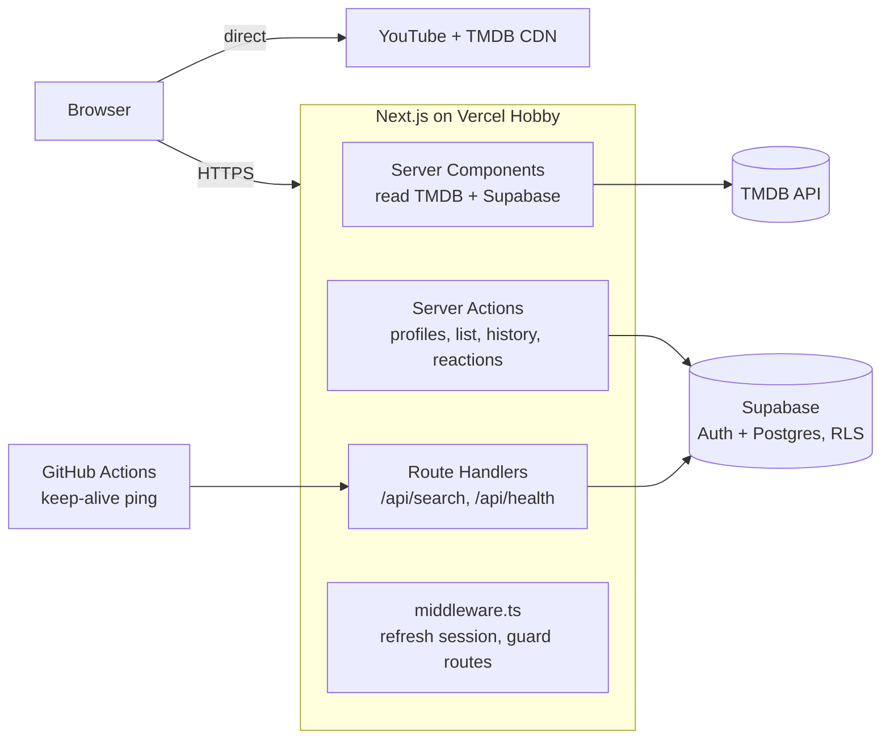

# Nontonin

A Netflix-style streaming web app built with Next.js, TypeScript, Supabase, and the TMDB
API — multi-profile accounts, My List, watch history, and trailer playback, secured with
row-level security. Runs entirely on free tiers.

> Status: in active development. See [PROJECT_PLAN.md](./PROJECT_PLAN.md) section 5 for the
> full sprint checklist and current progress.

## Stack

| Layer | Choice | Why |
| --- | --- | --- |
| Framework | Next.js (App Router) + TypeScript | Server Components for TMDB/Supabase reads, Server Actions for mutations |
| Styling | Tailwind CSS v4 + hand-rolled UI primitives (`components/ui/`) | Design tokens as CSS variables, no extra build step |
| Auth + DB | Supabase (Auth + Postgres, RLS on every table) | Free tier, RLS proves per-user data isolation without custom backend code |
| Content | TMDB API + YouTube trailer embeds | No copyrighted video hosting, official attribution in the footer |
| Hosting | Vercel Hobby | Free, automatic preview deployments per PR |
| CI | GitHub Actions | Lint, typecheck, unit tests, build on every push/PR |

## Architecture



Full PRD/SRS/SDD/UI-UX spec: [PROJECT_PLAN.md](./PROJECT_PLAN.md).

## Auth and RLS

- Sessions are managed by `@supabase/ssr` via httpOnly cookies (`lib/supabase/server.ts`,
  `lib/supabase/client.ts`); `middleware.ts` refreshes the session on every request and
  redirects guests away from `/profiles` and `/my-list` with a safe `returnTo`.
- Every table (`profiles`, `my_list`, `watch_history`, `reactions`) has row-level security
  enabled (`supabase/migrations/0001_init.sql`): a user can only read or write rows belonging
  to their own `profiles`. Server Actions always run with the caller's session, never the
  service-role key.
- `scripts/verify-rls.mjs` proves it against a real project: creates two throwaway accounts,
  confirms account B gets zero rows reading account A's profiles and is rejected writing to
  account A's `my_list`, and that a 6th profile on one account is rejected
  (`profile_limit_reached`). Run it with `npm run verify:rls` after filling in `.env.local`.

## Running locally

Prerequisites: Node.js 22+, a Supabase project (Free plan), a TMDB API Read Access Token.

```bash
cp .env.example .env.local
# fill in NEXT_PUBLIC_SUPABASE_URL, NEXT_PUBLIC_SUPABASE_ANON_KEY, TMDB_READ_TOKEN

npm install
npm run dev
```

Other scripts:

```bash
npm run lint       # ESLint
npm run typecheck  # tsc --noEmit
npm run test       # Vitest unit tests
npm run build      # production build
npm run verify:rls # integration check against real Supabase (see Auth and RLS above)
```

## Deployment notes (free tier)

- Vercel Hobby plan: non-commercial use only, `*.vercel.app` domain.
- Supabase Free projects pause after 7 days with no activity — a GitHub Actions workflow pings
  `/api/health` on a schedule to keep it alive (added in Sprint 5).
- TMDB usage is non-commercial with attribution in the footer of every page, as required by
  their terms.

## What I'm learning building this

Notes will land here as sprints complete — RLS design trade-offs, TMDB caching strategy, and
keeping a fully free-tier stack alive without a scheduled backend.
