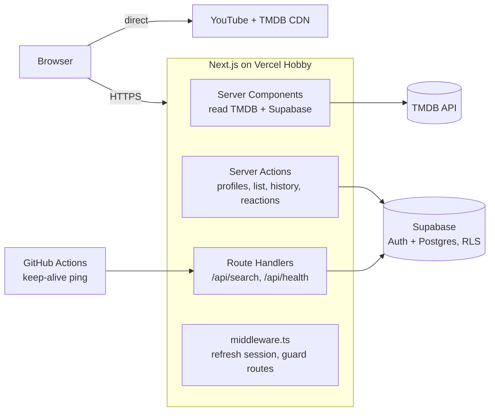

# Nontonin

A Netflix-style streaming web app built with Next.js, TypeScript, Supabase, and the TMDB
API — multi-profile accounts, My List, watch history, and trailer playback, secured with
row-level security. Runs entirely on free tiers.

**Live demo:** _pending Vercel deployment — see [PROJECT_PLAN.md](./PROJECT_PLAN.md) T0.5._

> Status: in active development. See [PROJECT_PLAN.md](./PROJECT_PLAN.md) section 5 for the
> full sprint checklist and current progress.

<!--
Screenshot/GIF placeholders — fill these in once deployed:


-->

## Features

- **Browse** — hero billboard + horizontally scrollable rows (Trending, Populer, Top Rated,
  genre, Series Populer), real TMDB data, per-row loading/error states.
- **Title detail** — synopsis, cast, genre, similar titles, real YouTube trailer playback.
- **Search** — debounced, real TMDB results, empty/error states.
- **Auth** — email/password register and login via Supabase Auth.
- **Multi-profile** — up to 5 profiles per account, 8 preset avatars, a kids profile that
  filters Browse to Animasi/Keluarga only.
- **My List, watch history, reactions** — all scoped per profile, all enforced by
  Postgres row-level security, not just app-layer checks.
- **Guest-first** — every browsing page works without an account; only saving/reacting
  prompts a login, and returns you to the exact title you were on.

## Stack

| Layer | Choice | Why |
| --- | --- | --- |
| Framework | Next.js (App Router) + TypeScript | Server Components for TMDB/Supabase reads, Server Actions for mutations |
| Styling | Tailwind CSS v4 + hand-rolled UI primitives (`components/ui/`) | Design tokens as CSS variables, no extra build step |
| Auth + DB | Supabase (Auth + Postgres, RLS on every table) | Free tier, RLS proves per-user data isolation without custom backend code |
| Content | TMDB API + YouTube trailer embeds | No copyrighted video hosting, official attribution in the footer |
| Hosting | Vercel Hobby | Free, automatic preview deployments per PR |
| CI | GitHub Actions | Lint, typecheck, unit tests, build on every push/PR |

## Architecture



Full PRD/SRS/SDD/UI-UX spec: [PROJECT_PLAN.md](./PROJECT_PLAN.md).

## Auth and RLS

- Sessions are managed by `@supabase/ssr` via httpOnly cookies (`lib/supabase/server.ts`,
  `lib/supabase/client.ts`); `middleware.ts` refreshes the session on every request and
  redirects guests away from `/profiles` and `/my-list` with a safe `returnTo`.
- Every table (`profiles`, `my_list`, `watch_history`, `reactions`) has row-level security
  enabled (`supabase/migrations/0001_init.sql`): a user can only read or write rows belonging
  to their own `profiles`. Server Actions always run with the caller's session, never the
  service-role key.
- `scripts/verify-rls.mjs` proves it against a real project: creates two throwaway accounts,
  confirms account B gets zero rows reading account A's profiles and is rejected writing to
  account A's `my_list`, and that a 6th profile on one account is rejected
  (`profile_limit_reached`). Run it with `npm run verify:rls` after filling in `.env.local`.

## Running locally

Prerequisites: Node.js 22+, a Supabase project (Free plan), a TMDB API Read Access Token.

```bash
cp .env.example .env.local
# fill in NEXT_PUBLIC_SUPABASE_URL, NEXT_PUBLIC_SUPABASE_ANON_KEY, TMDB_READ_TOKEN

npm install
npm run dev
```

Other scripts:

```bash
npm run lint       # ESLint
npm run typecheck  # tsc --noEmit
npm run test       # Vitest unit tests
npm run build      # production build
npm run verify:rls # integration check against real Supabase (see Auth and RLS above)
npm run test:e2e   # Playwright: guest trailer playback, register->profile->My List, search
```

`test:e2e` starts its own dev server on port 3100 and runs against real TMDB/Supabase data
from `.env.local` — no mocking, so results reflect the actual app.

## Deployment notes (free tier)

- Vercel Hobby plan: non-commercial use only, `*.vercel.app` domain.
- Supabase Free projects pause after 7 days with no activity — a GitHub Actions workflow pings
  `/api/health` on a schedule to keep it alive (`.github/workflows/keepalive.yml`); it needs a
  `SITE_URL` repo secret once deployed.
- TMDB usage is non-commercial with attribution in the footer of every page, as required by
  their terms.
- Security headers and a CSP (allowing YouTube embeds + TMDB/Unsplash images) are set in
  `next.config.ts`.

## What I learned building this

- **A CSS `background-image` is a bad choice for your LCP element.** The browser's preload
  scanner only finds it after parsing the stylesheet, which showed up as several seconds of
  Lighthouse's "Render Delay"/"Load Delay" on the hero. Switching to `next/image` with
  `priority` (which emits an eager `<link rel="preload">`) fixed the discovery timing —
  measured directly with `npx lighthouse` against a real production build, not guessed at.
- **React Strict Mode's double effect invocation can hide behind a state shape that looks
  the same as "just mounted."** A "close this modal after a successful submit" effect used a
  `useRef` to skip its first call, reasoning "the first call is always the mount." That's true
  once — but dev-mode Strict Mode calls the effect a second time immediately, and the guard
  only protected the first call, so the modal closed itself milliseconds after opening. It
  never showed up in production (no double-invoke there) and never threw an error — only
  writing a real Playwright test against it surfaced the symptom. The fix: key the close logic
  off an actual `pending: true -> false` transition, not an invocation counter.
- **A security header can silently break the thing it's protecting.** Adding a CSP without
  `'unsafe-eval'` blocked Next/Turbopack's dev-mode use of `eval()` for HMR, which looked
  identical to the Strict Mode bug above (client clicks doing nothing) until checked
  separately. Scoped `unsafe-eval` to development only, since Next confirms production never
  needs it.
- **Row-level security is worth demonstrating, not just enabling.** `alter table ... enable
  row level security` is one line; proving it actually stops account B from reading or writing
  account A's data needed an integration script (`scripts/verify-rls.mjs`) that creates real
  accounts and asserts the rejection — the kind of thing that's easy to configure wrong in a
  way that still "looks" secure until tested against two real sessions.
